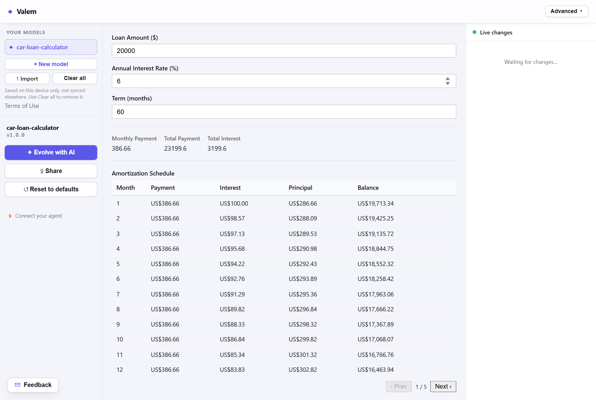

# Valem
{: .fs-9 }

A deterministic, reactive computation runtime for AI-generated structured data models — a
spreadsheet-like computation model for JSON-based agent systems.
{: .fs-6 .fw-300 }

[Try the live sandbox]({{ site.sandbox_url }}){: .btn .btn-primary .fs-5 .mb-4 .mb-md-0 .mr-2 target="_blank" rel="noopener" }
[Quickstart](){: .btn .fs-5 .mb-4 .mb-md-0 .mr-2 }
[View on GitHub]({{ site.gh_repo }}){: .btn .fs-5 .mb-4 .mb-md-0 target="_blank" rel="noopener" }

---

## In four lines

Declare how a value is computed, write only the inputs, read a document that is always consistent:

```jsonc
// 1. the spec says how `total` is computed — you never write it
"derivations": [ { "path": "$.total", "expr": "subtotal + tax" } ]
```

```bash
# 2. mutate base fields
curl -X POST localhost:8080/models/order/mutations \
     -d '{ "$.subtotal": 100, "$.tax": 8 }'

# 3. read the merged state
curl localhost:8080/models/order/state
#  → { "subtotal": 100, "tax": 8, "total": 108 }
```

`total` recomputed itself, in dependency order, touching only what the change affected — and any
constraint you declared was enforced before the mutation was allowed to commit. That is the whole
idea; everything else is scale, governance, and reach.

## What it's for

An LLM is good at *describing* a domain and bad at *maintaining consistent state* over it. Valem
closes that gap. You give it a **ModelSpec** — a declarative JSON document (typically LLM-generated)
naming a domain's fields, the formulas that derive values from them, the invariants that must always
hold, and the side effects that fire when conditions are met. Valem compiles that into a live,
reactive model.

Think of a spreadsheet — cells, formulas, validation — but addressed by JSON Path, expressed in
JSONata, and driven over a REST/WebSocket API, an in-process library, an MCP server, or a console.

[What is Valem? →]()

## See it running

[]({{ site.sandbox_url }}){: target="_blank" rel="noopener" }

A zero-setup public demo: describe a domain in plain language, watch an LLM generate a ModelSpec,
then type into it and see derivations, constraints, and effects react live.
[Open the sandbox →]({{ site.sandbox_url }}){: target="_blank" rel="noopener" } ·
[what to do in it]()

## Why it exists

- **Deterministic & replayable.** The pure core performs no I/O; the same inputs always produce the
  same state, and history replays without re-contacting the outside world.
- **Reactive by construction.** A dependency graph recomputes only what a change actually affects.
- **LLM-native.** Specs are JSON an LLM can generate, and Valem validates-and-repairs them in a loop.
- **Effectful, but governed.** **Effects** (HTTP, LLM calls, timers) are declared in the spec,
  executed post-commit behind an egress guard, and fold back into state as ordinary mutations —
  replay never re-runs I/O.
- **Explainable.** Every derivation and constraint evaluation is traceable, with an optional durable,
  tamper-evident audit trail.
- **Embeddable.** A pure-Java core with no framework lock-in, wrapped by an à-la-carte Spring layer.

Not sure it fits your problem? [Usage scenarios]() covers the four
shapes it fits best, and the [FAQ]() is blunt about when to use
something else.

## The documentation, in six chapters

| Chapter | Start here if you want to… |
|---|---|
| [Getting started]() | See it work, run it locally, or pair it with an AI agent. |
| [Usage scenarios]() | Decide whether it fits your project. |
| [Model guide]() | Write and understand a model. |
| [Reference]() | Look up a field, endpoint, tool, or component. |
| [Deployment]() | Run the API or the MCP server for real. |
| [Extending]() | Embed the engine or build on its seams. |

Plus a [glossary](), the [FAQ](), and the
[third-party libraries]() Valem stands on.

---

**Requirements:** Java 21+ · Maven 3.9+ · Node.js 20+ (for the UI only) — or Docker, which needs
none of them. Apache-2.0. Latest release: [v1.0.0]({{ site.gh_repo }}/releases/latest).

## See also
- [Valem sandbox](https://valem.onrender.com/)
- [Valem source code](https://github.com/vlad-public-code/org.json-kula.valem)
- [tracked-json](https://vlad-public-code.github.io/org.json-kula.tracked-json/) — Jackson JsonNode wrapper that tracks each node's location (JsonPointer) and document root through every navigation — get, path, at, parent(), and JSONPath (RFC 9535). Includes JSON Patch (RFC 6902).
- [jsonata-jvm-compiler](https://vlad-public-code.github.io/org.json-kula.jsonata-jvm-compiler/) — A Java library that compiles [JSONata](https://jsonata.org) expressions into native Java classes at runtime
