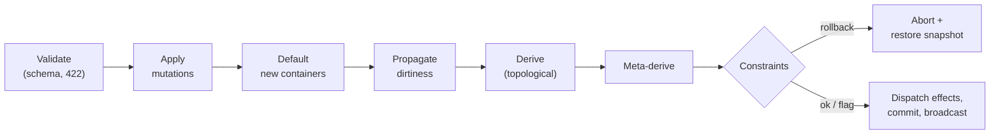

# The reactive pipeline
{: .no_toc }

Every mutation runs the same fixed sequence under a per-model lock. Knowing the order explains most
"why did it do that?" questions.
{: .fs-5 .fw-300 }

1. TOC
{:toc}

---

## The sequence

1. **Validate** each mutation against the effective schema — *before* a transaction is opened, so an
   invalid write costs nothing and returns `422`.
2. **Apply** the mutations to the base document (a rollback snapshot is taken first).
3. **Default** newly-created containers from `defaultValues`, filling only caller-absent fields.
4. **Propagate** [dirtiness](../glossary.md#dirty-propagation) through the [dependency graph](../glossary.md#dependency-graph) — reachable nodes only, wildcard patterns
   matched per element.
5. **Derive** dirty fields in topological [level](../glossary.md#evaluation-level) order. Each level evaluates against the merged
   document as of the previous level.
6. **Meta-derive** per-field metadata (min / max / required), per element for `[*]` paths.
7. **Check constraints** against the merged document: `rollback` aborts the whole cycle and restores
   the snapshot; `flag` records the violation and continues.
8. **Dispatch effects** whose triggers became true, then **commit** and broadcast a `ChangeEvent`.

## What the ordering guarantees

- **Nothing half-applied.** Schema validation precedes the transaction, and a `rollback` constraint
  restores the pre-mutation snapshot. A cycle either commits whole or leaves no trace.
- **Derivations see a consistent world.** Level *k+1* can read level *k*'s results; derivations
  *within* the same level cannot see each other, which is what keeps evaluation order deterministic
  rather than incidental.
- **Constraints and effects see derived values.** Both are evaluated against the merged document,
  never the raw base document — so a constraint can reference `total` even though nobody wrote it.
- **Effects never run inside the transaction.** They are dispatched as data at commit and executed
  afterwards by the shell, so I/O latency and I/O failure can't corrupt a commit.
- **Work is proportional to the change.** Only nodes reachable from what you mutated are dirtied,
  and the merged document is materialised once per cycle rather than once per evaluator.

## Reading the result

A mutation response is the actionable summary: `mutatedPaths`, `derivedUpdated`, `metaUpdated`,
`flaggedConstraints`, `dispatchedEffects`. Full derivation and constraint traces are available on
demand — `includeTraces` on the write, or `GET /models/{id}/explain/{path}` afterwards. Ask for them
when something looks wrong, not on every write.

Two levels of history, deliberately:

| | Scope | Where |
|---|---|---|
| `explain` / `get_history` | Bounded in-memory ring buffer (500 records) of recent evaluations | Always on |
| Audit trail | One durable, append-only record per committed cycle, with a tamper-evident hash chain | Opt-in — see [Persistence & operations]() |

The audit trail is the queryable superset: mutations, derived updates, traces, flagged constraints,
dispatched effect ids, the `source` (`client` / `patch` / `foldback`), and a per-model sequence
number.

## Changing the spec without losing state

`POST /models/{id}/spec/evolve` applies a **SpecEvolution**: a `newVersion` plus upsert/remove lists
per section. Existing state is carried forward, unchanged expressions keep their compiled form, and:

- `expectedVersion` makes the write conditional — a stale evolution gets `409`, not a silent
  overwrite of someone else's change.
- A schema change that would strand live values is refused with `422`.
- Schema, view, and constants also accept **targeted** diffs (by `$defs` name, by component id, by
  constant name) instead of wholesale replacement.

That's what makes iterating on a live model — with an agent, or in the sandbox — safe enough to do
casually. Details: [tests & spec evolution]().

## Concurrency, briefly

`ModelRuntime` is not thread-safe by design; `ModelService` serialises everything that touches a
model's mutable structures on that model's lock — including reads that write during evaluation
(lazy derivations). Different models proceed independently.

## Next

- [Effects](effects.md) — what happens after the commit.
- [Reactive engine internals]() — the dependency graph and
  algorithms behind steps 4–6.
- [API reference]() — the exact request/response shapes.
