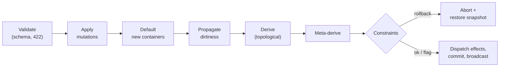

# The ModelSpec format
{: .no_toc }

A **ModelSpec** is a declarative JSON document — usually LLM-generated — that fully describes a
reactive model: its shape, its formulas, its invariants, and its side effects. Valem compiles it into
a live runtime.
{: .fs-5 .fw-300 }

1. TOC
{:toc}

---

## Anatomy

```json
{
  "id": "order",
  "version": "1.0.0",
  "schema": { "type": "object" },
  "constants":      { "taxRate": 0.08 },
  "defaultValues":  [ { "path": "$", "expr": "{ 'currency': 'USD' }" } ],
  "derivations":    [ { "path": "$.tax",   "expr": "subtotal * $const.taxRate" },
                      { "path": "$.total", "expr": "subtotal + tax" } ],
  "metaDerivations":[ { "path": "$.subtotal", "property": "minimum", "expr": "0" } ],
  "constraints":    [ { "id": "max-order", "expr": "total <= 5000",
                        "message": "Order exceeds the cap", "policy": "rollback" } ],
  "effects":        [ { "id": "large-order-alert", "executor": "caller", "trigger": "total > 1000",
                        "emit": "large-order", "payload": { "total": "total" } } ],
  "tests":          [ ]
}
```

## Field reference

| Field | What it does |
|---|---|
| `id`, `version` | Identity of the model and its spec version. |
| `schema` | JSON Schema for the base (writable) document. Local `$defs` / `$ref` are supported. |
| `constants` | Named immutable values (any JSON type), bound as `$const.<name>` in every expression. No dependency edge — a derivation reading only `$const` never recomputes. |
| `defaultValues` | `(path, expr)` rules that deep-merge into a **newly-created** container (array element, object, or root `$`), filling only caller-absent fields. A `$` rule seeds the root at creation. |
| `derivations` | Read-only computed fields. Evaluated in topological level order so a later level can read an earlier one. Wildcard paths (`$.items[*].lineTotal`) evaluate once per element with `$parent` bound. |
| `metaDerivations` | Live per-field metadata (min / max / required / …) that overlays the effective schema. |
| `constraints` | Boolean invariants with a `rollback` (reject the mutation) or `flag` (record a violation) policy. |
| `effects` | Requests the pure core emits as **data** — executed post-commit by a shell: `caller` (returned inline), `server` (HTTP with SSRF guard), `llm` (calls the configured model), `timer` (scheduled), or a custom plugin kind. Replay never re-runs I/O. See the [Effects guide](). |
| `tests` | Embedded spec-level test cases the runtime can execute. |
| `viewDefinition` | An optional renderer-agnostic UI component tree, evaluated by `valem-view`. |

## Addresses vs expressions

Two distinct dialects, and Valem keeps them separate:

- **Addresses** — paths used *as data* (`path` fields, `defaultValues` paths, mutation keys, view
  `bind`) — must be canonical **JSON Path**: `$.`-rooted with bracket indices, e.g.
  `$.order.items[0].qty` (wildcard `$.order.items[*].qty`). Non-canonical addresses are rejected.
- **Expressions** — the bodies of `expr` / `trigger` / `payload` — are **JSONata**
  (`order.subtotal + order.tax`) and are never rewritten.

## The reactive pipeline

Every `mutate` runs a fixed pipeline under a per-model lock:



1. **Validate** each mutation against the effective schema (HTTP 422 before any transaction).
2. **Apply** the mutations to the base document.
3. **Default** newly-created containers (`defaultValues`).
4. **Propagate** dirtiness through the dependency graph (only reachable nodes).
5. **Derive** dependent fields in topological order.
6. **Meta-derive** per-field metadata.
7. **Check constraints** against the merged document; `rollback` aborts, `flag` records.
8. **Dispatch effects**, then **commit** and broadcast a `ChangeEvent`.

## Evolving a spec

A model's spec can change without losing state via `POST /models/{id}/spec/evolve`: an incremental
diff carrying a `newVersion` plus upsert/remove lists per section. Existing state is carried forward,
unchanged expressions keep their compiled form, and a schema change that would strand live values is
rejected (422).

---

The full, authoritative field-by-field reference (including the view component catalog and every
effect option) is the [Model spec format]() reference.
